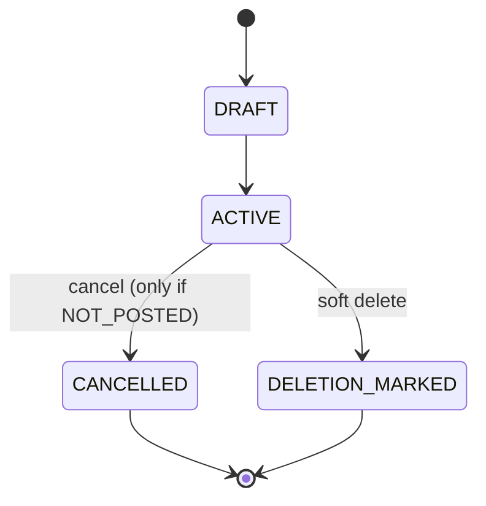
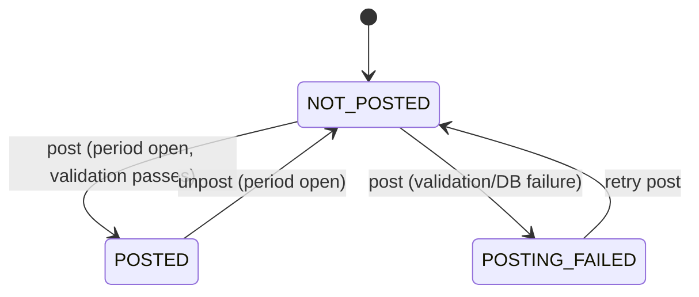
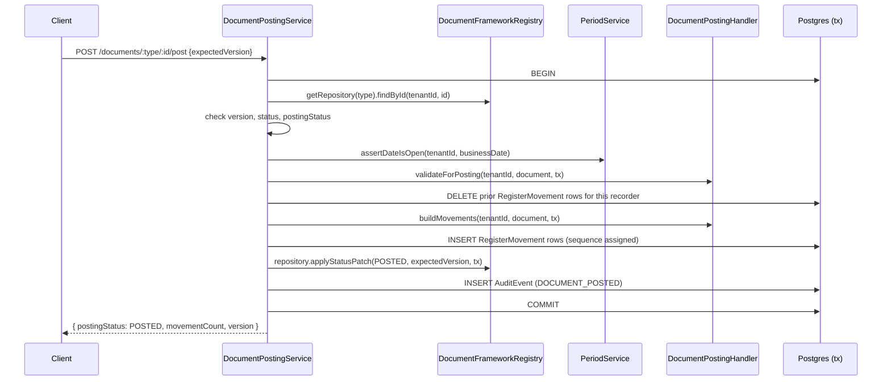
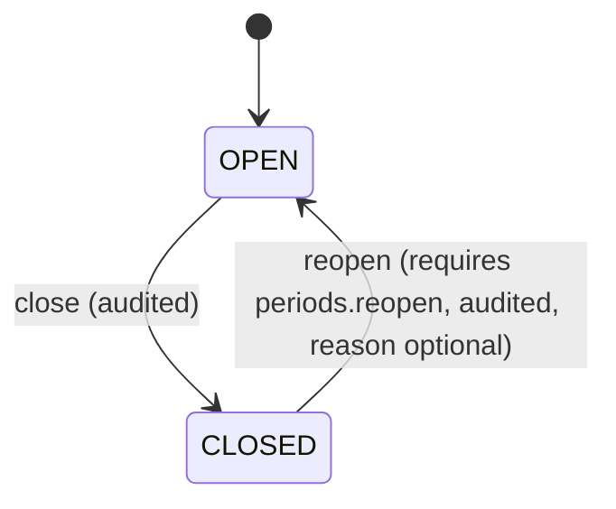
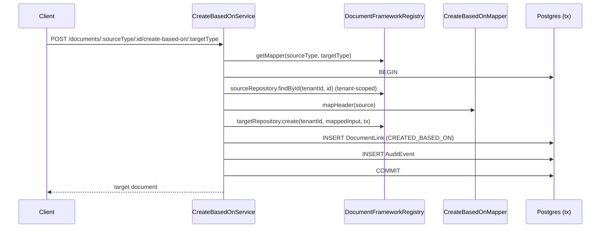

# Phase 0 — Architecture

This document is the Phase 0 technical documentation deliverable (spec
section 74): module map, dependency direction, tenant context lifecycle,
authentication/authorization flow, document lifecycle, posting lifecycle,
transaction boundaries, period validation, numbering flow, audit flow, and
the Create Based On flow.

Stack: NestJS (TypeScript) modular monolith, PostgreSQL via Prisma, JWT
access/refresh auth, argon2id password hashing.

## Module map & dependency direction

```
                        ┌────────────────────┐
                        │   PrismaModule      │  (global)
                        │ RequestContextModule│  (global)
                        └─────────┬───────────┘
                                  │
        ┌──────────────┬─────────┼─────────┬───────────────┐
        ▼              ▼         ▼         ▼               ▼
   IdentityModule  TenantModule RbacModule AuditModule SettingsModule
        │              │         │         ▲               
        │              └────┬────┘         │ (used by many)
        │                   ▼               
        │            CurrencyModule   NumberingModule   PeriodModule
        │                                                    ▲
        │                                                    │
        │                              DocumentFrameworkModule
        │                              (registry + posting engine)
        │                                        ▲
        │                              DocumentLinkModule
        │                              (links + Create Based On)
        │                                        ▲
        └───────────────────────────► FoundationTestDocumentModule
                                       (demo document type, registers
                                        itself into the framework)
```

Dependency direction is strictly one-way: `DocumentFrameworkModule` and
everything below `PrismaModule`/`RequestContextModule` know nothing about
`FoundationTestDocumentModule` — the demo module depends on the framework
and registers itself into it at boot (`onModuleInit`), never the reverse.
This is the seam every future business module (Sales, Purchase, ...) uses.

## Tenant context lifecycle

1. `JwtAuthGuard` verifies the access token, attaches `{userId, email,
   isSystemAdmin}` to `request.user`.
2. `TenantContextGuard` reads `X-Tenant-Id`, loads the caller's
   `TenantMembership` (must be `ACTIVE`) plus every role/permission attached
   to it, and publishes `{tenantId, membershipId, permissions}` into
   `RequestContextService` (backed by `nestjs-cls`, so it is available
   anywhere in the call stack without threading it through every function).
3. `PermissionsGuard` checks the route's `@RequirePermissions(...)` (or
   `@SystemAdminOnly()`) against that resolved permission set.
4. A route can opt out of steps 2-3 with `@SkipTenantContext()` (e.g. "list
   my tenant memberships") or opt out of all auth with `@Public()`.

An ID belonging to another tenant, or a disabled/absent membership, always
produces the same `404 NOT_FOUND` shape — no signal distinguishes "tenant
doesn't exist" from "you're not a member" (see `TenantContextGuard`).

## Authentication / authorization flow

- **Authentication**: `POST /auth/register` and `/auth/login` issue a short
  lived JWT access token (`JWT_ACCESS_TTL`, default 15m) and an opaque
  refresh token stored only as a SHA-256 hash (`refresh_tokens` table).
  `POST /auth/refresh` rotates it: the old token is revoked and a new pair
  issued, so a stolen-then-replayed refresh token stops working the moment
  the legitimate client refreshes.
- **Authorization (RBAC)**: `User -> TenantMembership -> MembershipRole ->
  Role -> RolePermission -> Permission`. Business logic never checks a role
  name — only permission codes (`src/rbac/permission-codes.ts`), enforced
  server-side by `PermissionsGuard` regardless of what the UI hides.
- **System vs Tenant administrator**: `User.isSystemAdmin` is a platform-wide
  flag, checked only by `@SystemAdminOnly()`, and is completely independent
  of the seeded `TENANT_ADMIN` role which only grants tenant-scoped
  permissions. Phase 0 does not yet expose system-admin-only endpoints
  beyond the flag/guard existing — later phases layer platform operations
  behind it.

## Document lifecycle

Every document has two independent axes (never combined):

- **status**: `DRAFT -> ACTIVE -> CANCELLED | DELETION_MARKED`
- **postingStatus**: `NOT_POSTED -> POSTED -> NOT_POSTED (unpost) |
  POSTING_FAILED`





Approval status is deliberately NOT modeled yet (section 9) — reserved
codes (`NOT_REQUIRED | PENDING | APPROVED | REJECTED`) are seeded in the
enumeration foundation so Phase 26 can add a third, independent axis
without touching `BaseDocumentFields` or any concrete document table.

## Posting lifecycle & transaction boundary

`DocumentPostingService.post/unpost/cancel` (src/document-framework/) is the
ONLY code path allowed to flip `postingStatus`. Everything below happens
inside one `prisma.$transaction`:



If ANY step throws — validation, a DB constraint, `applyStatusPatch`
reporting 0 rows updated (a concurrent change) — the entire transaction
rolls back: no movement row, no status flip, no audit event survives a
failed post. This is verified in `test/phase0.e2e-spec.ts` ("Posting
transaction atomicity").

`unpost` follows the same shape in reverse (delete movements, flip to
`NOT_POSTED`, audit). Reposting (posting again after unposting, or after
editing a still-unposted document) is safe because every `post` call first
deletes any movements already recorded for that exact
`(recorderDocumentType, recorderDocumentId)` pair before generating new
ones — stale movements never survive.

### Extensibility (handler registry)

`DocumentFrameworkRegistry` maps `documentType -> DocumentPostingHandler`
and `documentType -> DocumentRepositoryAdapter`. `DocumentPostingService`
never branches on document type — a new business document type (Phase 1+)
implements both interfaces and registers them in its own module's
`onModuleInit`, exactly like `FoundationTestDocumentModule` does. No giant
`if (type === ...)` switch ever appears in the framework.

## Period validation

`PeriodService.assertDateIsOpen(tenantId, businessDate, organizationId?)` is
the single choke point every posting/unposting flow calls before writing
anything. If no period row covers the date, posting is allowed (Phase 0
does not mandate periods exist for every date); if a period row exists and
its status isn't `OPEN`, posting is blocked with `PERIOD_CLOSED` — even for
a user who otherwise holds `documents.post`. Only an explicit, permissioned,
audited `POST /periods/:id/reopen` lifts it.



## Numbering flow

`NumberingService.allocateNumber(tenantId, code, businessDate, tx?)`:

1. `SELECT ... FOR UPDATE` on the `number_sequences` row for
   `(tenantId, code)` — takes a row lock for the rest of the transaction.
2. Compute whether a reset is due (`YEARLY`/`MONTHLY` reset policies
   compare against the row's stored `current_year`/`current_month`).
3. Compute `allocated` (either `1` on reset, or the current `next_number`)
   and write back `next_number = allocated + 1` in the same transaction.
4. Format `PREFIX-YEAR-000123` and return it.

A second concurrent caller targeting the same sequence blocks at step 1
until the first transaction commits (or rolls back), so it can never
observe or allocate the same number — no `SELECT MAX(number) + 1` race is
possible. A DB unique constraint on `(tenantId, number)` per document table
is the final backstop. Verified with 60 concurrent document creations in
the e2e suite (0 duplicates).

## Audit flow

`AuditService.record(...)` is called directly from application services
(never the frontend) for every state-changing operation, optionally passed
the same `tx` as the operation it describes — so a `DOCUMENT_POSTED` audit
row can never exist without the posting transaction it describes having
actually committed successfully. Payloads are redacted for known-sensitive
keys before being persisted. `audit_events` is treated as append-only —
no route updates or deletes them.

## Create Based On flow



Cross-tenant target creation is structurally impossible: the source lookup
is scoped to `tenantId`, and the target is always created with that same
`tenantId` — there is no code path where they can differ. Field-mapping
logic lives entirely inside each mapper (e.g.
`FoundationTestDocumentSelfMapper`); the engine itself never knows about
business fields. Remaining-quantity / partial-fulfillment / many-to-many
chain semantics are explicitly out of scope (Phase 27).
